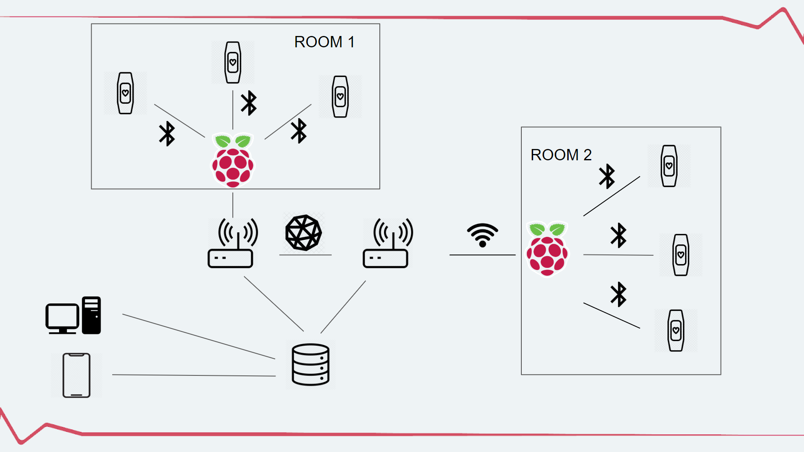

# MoyoBand
Science project realized by SKN Telephoners at AGH UST. Our goal is make wireless system to monitor life and health of patient.
Projekt naukowy, realizowany przez SKN Telephoners. Naszym celem jest stworzenie bezprzewodowego systemu, monitorującego życie i zdrowie pacjenta.
# Network
It's a part of main project. This section is responsible for providing communication between database and devices.  

