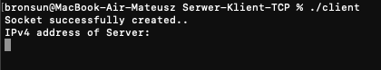

# TCP 


---
## Table of Contents

- [Description](#description)
- [How To Use](#how-to-use)
- [Author Info](#author-info)

---

## Description

To transfer data from nRF52840 to server via WiFi protocl we used TCP. In this directory we created tcp_client and tcp_server(server is only for prototype) in C language. 
#### Technologies

- TCP
- C
- Server
- Raspberry Pi Zero
- Linux

[Back To The Top](#read-me-template)

---

## How To Use

### Server
1. Download ***server_tcp.c*** on your computer
2. Compile it 
```
gcc -o server server_tcp.c
```
3. Run your server
```
./server
```


### Client

1. Download ***client_tcp.c*** on your computer
2. Transfer ***client_tcp.c*** to your Raspberry Pi Zero using ```scp``` command
```
scp client_tcp.c pi@<ip_of_your_raspberry>:~/BLE-central-heart/
```
3. Connect to your Raspberry Pi Zero via SSH
4. Change your directory to ***BLE-central-heart***
```
cd BLE-central-heart/
```
5. Compile your ***client_tcp.c***
```
gcc -o client client_tcp.c
```
6. Run your app
```
./client
```
7. Program will ask you to type IPv4 address of your server

 

8. To check IPv4 address go to your computer and open terminal
9. To check IPv4 just type 
```
ifconfig
```
10. Your server's IPv4 should be the first one you see    
---

## Author Info

- LinkedIn - [Mateusz Broncel](https://www.linkedin.com/in/mateusz-broncel-339921149/)
- GitHub   - [Mateusz Broncel](https://github.com/Bronsun?tab=repositories)
- Facebook - [Mateusz Broncel](https://www.facebook.com/profile.php?id=100002577283334)
- Facebook - [Mateusz Ogonowski](https://www.facebook.com/mateusz.ogonowski.501)
[Back To The Top](#read-me-template)
